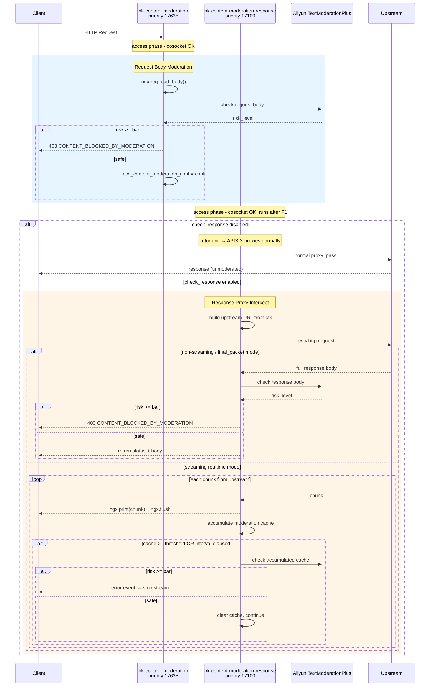

# bk-content-moderation: Multi-Plugin Content Moderation System

## Overview

A content moderation system for BlueKing API Gateway that uses Aliyun TextModerationPlus API to check HTTP request and response bodies for policy violations. Supports both streaming and non-streaming responses with blocking capability.

## Problem

APISIX's `body_filter` phase does **not** support cosocket operations (HTTP calls). This makes it impossible to call external moderation APIs during response body processing in a single plugin.

## Solution: Two Cooperating Plugins

Following the same architectural pattern as `ai-proxy`, we split the work into two plugins:

| Plugin | Priority | Role |
|--------|----------|------|
| `bk-content-moderation` | 17635 | Request body moderation (blocking) in `access` phase |
| `bk-content-moderation-response` | 17100 | Response proxy intercept + moderation in `access` phase |

Both plugins share a common Aliyun API client module: `bk-content-moderation/aliyun_text_moderation.lua`.

## Architecture



## Plugin Execution Order in APISIX Chain

```
Priority  Plugin                             Phase
────────  ─────────────────────────────────  ──────────────────
18825     bk-backend-context                 Context injection
18800     bk-log-context                     Context injection
  ...     (auth, token, verify plugins)      Authentication
17680     bk-auth-validate                   Authorization
17662     bk-ip-restriction                  Restriction
17653     bk-resource-rate-limit             Rate limiting
17640     bk-permission                      Permission
──────────────────────────────────────────────────────────────
17635     bk-content-moderation              REQUEST MODERATION
──────────────────────────────────────────────────────────────
17430     bk-proxy-rewrite                   Proxy setup
17150     bk-mock                            Mock responses
──────────────────────────────────────────────────────────────
17100     bk-content-moderation-response     RESPONSE MODERATION
──────────────────────────────────────────────────────────────
          APISIX proxy_pass                  (skipped if P2 active)
```

Key: All cheaper checks (auth, IP, rate limit, permission) run **before** content moderation to minimize Aliyun API calls. The response plugin runs **last** before proxy_pass, intercepting the proxy process when response checking is enabled.

## Configuration

Both plugins are configured on the same route. Plugin 1 carries all moderation configuration; Plugin 2's schema is minimal (empty object).

```json
{
    "plugins": {
        "bk-content-moderation": {
            "endpoint": "https://green-cip.cn-shanghai.aliyuncs.com",
            "region_id": "cn-shanghai",
            "access_key_id": "LTAI5t...",
            "access_key_secret": "secret...",
            "check_request": true,
            "request_check_service": "llm_query_moderation",
            "request_check_length_limit": 2000,
            "check_response": true,
            "response_check_service": "llm_response_moderation",
            "response_check_length_limit": 5000,
            "risk_level_bar": "high",
            "stream_check_mode": "realtime",
            "stream_check_cache_size": 128,
            "stream_check_interval": 3,
            "timeout": 5000,
            "upstream_timeout": 60000
        },
        "bk-content-moderation-response": {}
    }
}
```

### Configuration Reference

| Field | Type | Default | Description |
|-------|------|---------|-------------|
| `endpoint` | string | _(required)_ | Aliyun content moderation API endpoint |
| `region_id` | string | _(required)_ | Aliyun region ID |
| `access_key_id` | string | _(required)_ | Aliyun access key ID |
| `access_key_secret` | string | _(required)_ | Aliyun access key secret (encrypted at rest) |
| `check_request` | boolean | `true` | Enable request body moderation |
| `request_check_service` | string | `"llm_query_moderation"` | Aliyun moderation service name for requests |
| `request_check_length_limit` | number | `2000` | Max characters per moderation API call (request) |
| `check_response` | boolean | `false` | Enable response body moderation |
| `response_check_service` | string | `"llm_response_moderation"` | Aliyun moderation service name for responses |
| `response_check_length_limit` | number | `5000` | Max characters per moderation API call (response) |
| `risk_level_bar` | enum | `"high"` | Minimum risk level to trigger blocking: `none` < `low` < `medium` < `high` < `max` |
| `stream_check_mode` | enum | `"final_packet"` | Streaming check mode: `final_packet` (buffer all, check at end) or `realtime` (periodic checks during stream) |
| `stream_check_cache_size` | integer | `128` | Characters to accumulate before a realtime check |
| `stream_check_interval` | number | `3` | Seconds between realtime checks |
| `timeout` | integer | `5000` | Aliyun API call timeout (ms) |
| `upstream_timeout` | integer | `60000` | Upstream request timeout when proxy intercepting (ms) |
| `ssl_verify` | boolean | `true` | Verify SSL certificates for Aliyun API |
| `keepalive` | boolean | `true` | Enable connection keepalive to Aliyun API |
| `keepalive_pool` | integer | `30` | Keepalive connection pool size |
| `keepalive_timeout` | integer | `60000` | Keepalive connection timeout (ms) |

## Streaming Modes

### `final_packet` (Default)

Buffers the entire upstream response before checking with Aliyun. The client receives nothing until moderation completes.

- **Pros**: Can fully block risky responses; no partial content leaks
- **Cons**: Adds latency equal to upstream response time + moderation check time; loses streaming benefit

### `realtime`

Streams chunks to the client in real-time while periodically checking accumulated content with Aliyun. Can interrupt the stream mid-way if risky content is detected.

- **Pros**: Low latency (near-instant first byte); true streaming support
- **Cons**: Some content may reach the client before a risky check triggers

```
Upstream chunk 1 → client sees chunk 1 immediately
Upstream chunk 2 → client sees chunk 2 immediately
  ... cache accumulates to 128 chars ...
  → Aliyun check: SAFE → clear cache, continue
Upstream chunk N → client sees chunk N
  ... 3 seconds elapsed ...
  → Aliyun check: RISKY → send error event, stop stream
```

Trigger conditions for a moderation check (any one triggers):
1. Accumulated cache >= `stream_check_cache_size` (default 128 chars)
2. Time since last check >= `stream_check_interval` (default 3s)
3. End of stream (EOF)

## How Response Proxy Intercept Works

When `check_response` is enabled, `bk-content-moderation-response` takes over the proxy process in the `access` phase:

1. Reads upstream config from `ctx.matched_upstream` (nodes, scheme) and `ctx.var.upstream_host` / `ctx.var.upstream_uri` (set by `bk-proxy-rewrite`)
2. Uses `resty.http` to make the upstream request itself (copying method, headers, body from the original request)
3. Processes the response (check with Aliyun, streaming or not)
4. Returns `(status, body)` from `access()`, which causes APISIX to short-circuit and skip its built-in `proxy_pass` (same pattern as `bk-mock`)

### Trade-offs

Since the response plugin bypasses APISIX's built-in proxy:
- APISIX load balancing, health checks, and retry logic are not used (upstream node is selected from `ctx.matched_upstream.nodes`)
- Response-phase plugins (`header_filter`, `body_filter`) do not process the intercepted response
- The `log` phase still runs, so logging plugins work normally

This is the same trade-off that `ai-proxy` makes in the official APISIX distribution.

## Aliyun TextModerationPlus API

The shared client module (`aliyun_text_moderation.lua`) handles:

- **HMAC-SHA1 signature**: Required by Aliyun's API authentication. Includes special RFC 3986 sub-delimiter encoding (`!`, `'`, `(`, `)`, `*`) that OpenResty's `ngx.escape_uri` does not cover.
- **Long content splitting**: Content exceeding `length_limit` is split by UTF-8 character boundaries using `lua-utf8.sub()`. Each segment is checked independently. First segment that triggers stops further checking (short-circuit).
- **Session correlation**: A UUID v4 session ID is generated per request and passed to all moderation calls within the same request, enabling Aliyun to do contextual analysis.
- **Connection pooling**: HTTP keepalive with configurable pool size and timeout.

## Error Handling

All blocking responses use the standard `bk-core.errorx` system:

```json
{
    "error": {
        "code": 1640305,
        "code_name": "CONTENT_BLOCKED_BY_MODERATION",
        "message": "Request blocked by content moderation policy",
        "result": false,
        "data": null
    }
}
```

When the Aliyun API returns an error (timeout, network issue, etc.), the plugin logs the error and **passes the request through** (fail-open). This prevents the moderation service from becoming a single point of failure.

## File Structure

```
src/apisix/plugins/
├── bk-content-moderation.lua              # Plugin 1: Request moderation
├── bk-content-moderation-response.lua     # Plugin 2: Response proxy + moderation
├── bk-content-moderation/
│   ├── DESIGN.md                          # This document
│   └── aliyun_text_moderation.lua         # Shared Aliyun API client
└── bk-core/
    └── errorx.lua                         # + new_content_blocked_by_moderation()

src/apisix/tests/
├── test-bk-content-moderation.lua         # Unit tests: request plugin + Aliyun client
└── test-bk-content-moderation-response.lua # Unit tests: response plugin

src/apisix/t/
└── bk-content-moderation.t               # Integration tests
```
